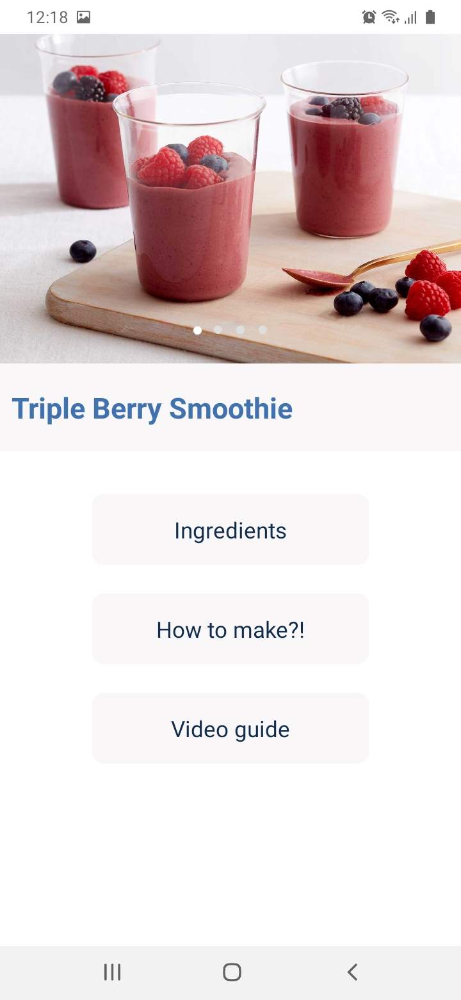
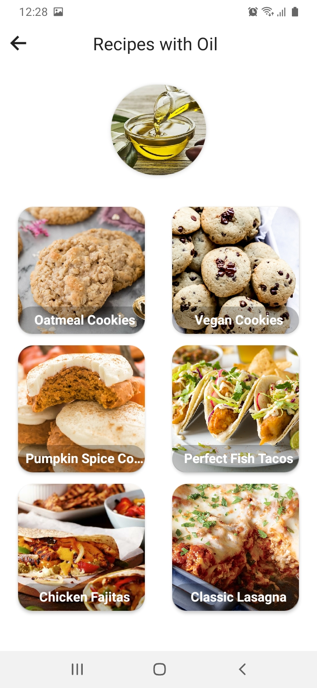

# Recipes
* This is a mobile application sample that provide food recipes.
* This application is developed using React-Native.

### photo of The Application

          

# You Can Do... 
### As User
* You can view recipes.
* You can view recipes ingredients.
* You can view recipes by ingredients.
* You can view recipes categories.
* You can search recipes.
* You can view recipes and ingredients details and photos.

## Install
* you must have nodejs on your machine

## Run the React project
* 1 ) Download the project React.
* 2 ) Enter the React-Native project folder.
* 3 ) Run 'yarn install' from the command line.
* 4 ) Run 'react-native link' from the command line.
* 5 ) Run 'react-native run-android' for android and 'react-native run-ios' for iOS from the command line.

## App direct download link
 * https://drive.google.com/file/d/1Ar4Ff5jaZVLWXFr1OeHAqymOTAdyukFx/view?usp=sharing
